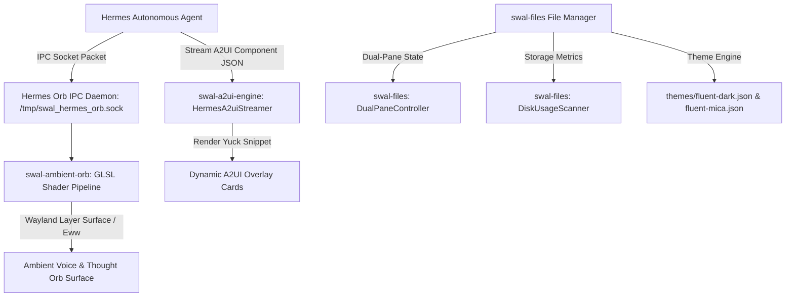

# SWAL Desktop: Windows / Files-Inspired Fluent Theme & Hermes Ambient Voice Orb Pipeline

> **Version**: 1.3.0  
> **Status**: Production Ready  
> **Protocol**: GitCore v3.8  
> **Default Agent**: **Hermes** (`Hermes Orchestrator & AUI Engine`)

---

## 1. Executive Summary & Design Vision

SWAL Desktop combines the minimalist, responsive aesthetics of **Files App** ([`files-community/Files`](https://github.com/files-community/Files)) with the cognitive execution runtime of **Hermes Agent**. 

This system provides:
1. **Windows 11 / Fluent 2 Inspired Design Language**:
   - Deep **Mica Acrylic blur** backgrounds (`themes/fluent-dark.json` and `themes/fluent-mica.json`).
   - Signature **Fluent Blue accent** (`#60cdff` / `#0078d4`) with subtle `1px` translucent top highlight borders (`rgba(255, 255, 255, 0.08)`).
   - **Segmented breadcrumb chevrons**, rounded tab strips, and dual-pane file management.
   - **Dynamic Drive Space & Linux Storage Usage visualizer** (`crates/swal-files/src/storage.rs`).
2. **Hermes Agent A2UI Ambient Orb Surface**:
   - Multi-state GLSL particle shader reflecting cognitive states: `Idle`, `ListeningVoice`, `DecomposingPlan`, `StreamingA2Ui`, `ExecutingToolAction`, and `ErrorAlert`.
   - **Async Unix Domain Socket IPC Daemon** (`/tmp/swal_hermes_orb.sock`).
   - Direct declarative **A2UI Component Streamer** (`crates/swal-a2ui-engine/src/hermes_streamer.rs`) generating dynamic UI cards and actions on the fly.
   - **Radial Interactive Action Menu** in Eww (`eww/hermes_orb.yuck` & `eww/scripts/hermes_orb_menu.py`).

---

## 2. Architecture & Component Interaction



---

## 3. Themes: Windows / Files-Inspired Tokens

### `themes/fluent-dark.json`
- **Background (`bg`)**: `rgba(32, 32, 32, 0.94)` (Mica dark)
- **Elevated (`elevated`)**: `rgba(44, 44, 44, 0.70)`
- **Accent Primary**: `#60cdff` (Fluent Sky Blue)
- **Accent Secondary**: `#0078d4` (Windows Core Blue)
- **Borders**: `rgba(255, 255, 255, 0.08)` highlight with `rgba(96, 205, 255, 0.45)` active glow.

### `themes/fluent-mica.json`
- **Background (`bg`)**: `rgba(24, 24, 28, 0.88)` (Translucent acrylic with wallpaper bleedthrough)
- **Elevated Surfaces**: `rgba(36, 36, 44, 0.75)`
- **Hyprland Borders**: `rgba(60cdffff) rgba(0078d4ff) 45deg`

---

## 4. Hermes Ambient Orb State Machine & IPC

### Packet Schema (`/tmp/swal_hermes_orb.sock`)
```json
{
  "agent_id": "hermes",
  "state": "DecomposingPlan",
  "prompt_summary": "Creating 15 micro-tasks for Wave 3",
  "audio_level": 0.65,
  "progress_pct": 75.0
}
```

### Supported States & Shader Animations
| State | Visual Behavior | Shader File | Color Identity |
|---|---|---|---|
| `Idle` | Gentle organic sine breathing wave | `HERMES_IDLE_BREATHE_SHADER` | Deep Slate / Muted Cyan |
| `ListeningVoice` | High-frequency reactive audio ripple | `CYAN_CYBER` | Electric Cyan (`#06b6d4`) |
| `DecomposingPlan` | Multi-octave swirling particle vortex | `HERMES_COGNITION_VORTEX_SHADER` | Vivid Indigo & Purple (`#8b5cf6`) |
| `StreamingA2Ui` | Dynamic flowing fluid sine wave stream | `HERMES_A2UI_STREAM_SHADER` | Electric Emerald & Cyan (`#10b981`) |
| `ExecutingToolAction` | Pulsing high-velocity rotating rings | `ORANGE_THOUGHT` | Amber Orange (`#f97316`) |
| `ErrorAlert` | Sharp turbulent pulse | `ALERT_SHADER` | Crimson Red (`#ef4444`) |

---

## 5. CLI Controller: `swal-hermes-orb`

The companion CLI tool `scripts/swal-hermes-orb` allows controlling the ambient orb and applying Fluent theme tokens directly from the shell or shortcuts:

```bash
# Set Hermes to Thinking state with a prompt
swal-hermes-orb state think -p "Refactoring dual-pane layout"

# Switch theme to Files-inspired Fluent Dark
swal-hermes-orb theme fluent-dark

# Toggle the Hermes Orb overlay on/off
swal-hermes-orb toggle

# Stream mock A2UI widget card
swal-hermes-orb stream-mock "Deployment Status" "15 micro-tasks passing"
```

---

## 6. Dual-Pane & Storage Engine in `swal-files`

- **Dual-Pane Layout**: Synchronized left/right navigation panes with tab isolation and active focus indicators.
- **Disk Usage Scanner**: Probes `/proc/mounts` and `statvfs` on Linux to display capacity percentage progress bars for NVMe, SSD, and external storage drives.
- **Tab Tooltips & Reorder**: Extended hover previews and drag/drop reorder indices.
